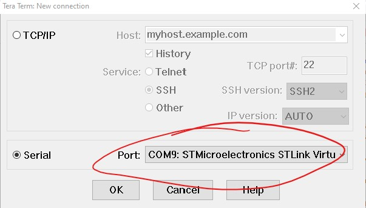
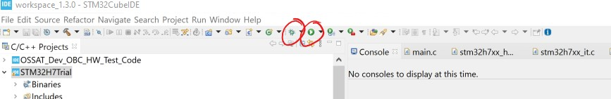
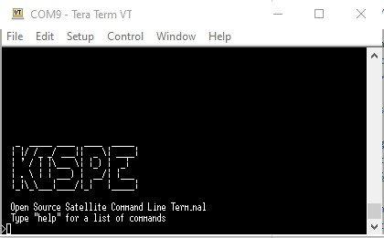
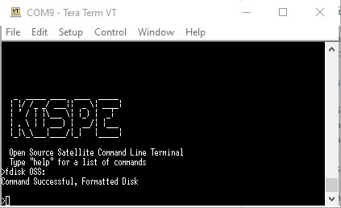
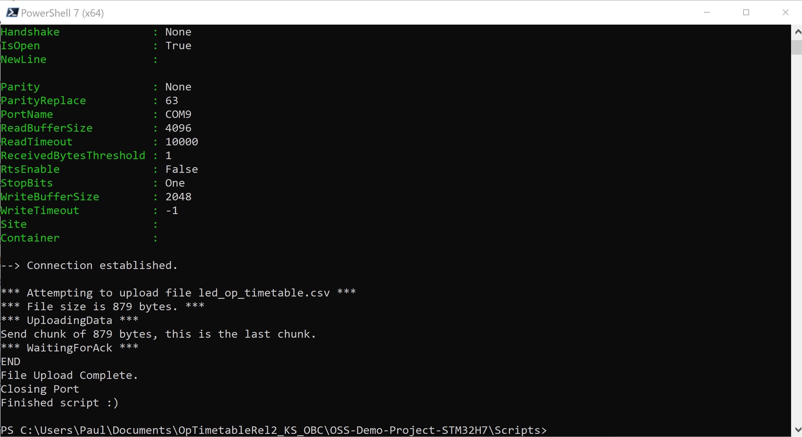

# Running application code on the OBC
This readme gives the details you'll need to run our OSSAT application on our OSSAT OBC development board, it also gives details of how to use the simple command line interface and how to get the file system going.  

## Contents
- [Building the code](#building-the-code)
- [Running the code](#running-the-code)
- [Using the CLI](#using-the-cli)
- [Formatting the disk](#formatting-the-disk)
- [Downloading files](#deownloading-files)
- [Uploading files](#uploading-files)
- [Reading the Command and Error Log](#reading-the-command-and-error-log)

## Building the code
If you are an OSSAT collaborator, you'll be able to access the OBC application code at [this](https://github.com/Open-Source-Satellite/OSS-Demo-Project-STM32H7) repository. For information about building the code, go to this repository.

**NOTE: The STMCubeIDE project includes build configurations for different builds (e.g. Unit Tests, Bootloader, Main Application etc). Therefore, before hitting the build button, you'll need to switch to the relevant build configuration which is MAIN_IMAGE_DEBUG_SECTOR_0_KS_OBC. This change can be made by navigating to the Project dropdown->Build Configurations->Set Active->MAIN_IMAGE_DEBUG_SECTOR_0_KS_OBC. See the below image:**


## Running the code
In order to run the code, you'll need some form of UART/Serial terminal program. We tend to use [TeraTerm](https://ttssh2.osdn.jp/index.html.en). You'll also need an [ST Link SWD/JTAG device](https://www.st.com/en/development-tools/stlink-v3set.html). The board is designed with a compatible SWD/JTAG connector.

Perform the following procedure:
1. Connect the ST Link to the board at one end and to your PC running STM Cube on the other end.


2. Apply 5V to the micro USB power connection to the board (a seperate connector to the ST-Link). (setting any relevant current limit to 0.5A should provide plenty of power to overcome in-rush).
3. Run your chosen terminal program at 115200 baud 8-N-1 configuration. Select the COM port labelled "STMicroelectronics STLink Virtual COM Port"



4. Once the code is built, you can either load and run (the green "go" icon) OR load, and debug run (the bug symbol) 



5. You should now observe some output on the Command Line Interface (CLI) through your chosen serial program.



6. Typing "help" into the CLI will list the available commands.

## Formatting the disk
Since the OSSAT development board does not include non-volatile memory (unlike the flight version that makes use of MRAM), you'll need to format the disk following any power cycle. The board features 8 MBytes of SRAM that can be formatted using the CLI command "fdisk OSS:/"
You may notice some error messages in response to the disk formatting that relate to the closure of files that may not exist.



Once formatted... Another reset (via the MCU reset button) will cause the command and error log file to be created.

## Downloading files
You'll find that you can navigate around the file system through the Linux-esque commands such as "ls", "cd", "pwd". You can also use the download command to download files, the command gives you 10 seconds (to start file logging in your chosen serial program) before printing the content of the file to the serial terminal.

## Uploading files
At the time of writing, the CLI code uses inefficient STDIO function calls to read the serial data. These calls are too slow to keep up with serial data at the maximum rate. Therefore, we've written a small Windows Powershell utility that slows down the data transmission to a level that the STDIO calls can support. Therefore, in order to upload files, run the following steps:

1. Install PowerShell v7+ for Windows.
2. navigate to the "Scripts" subdirectory in the STM32Cube Project.
3. Disconnect any serial programs from the serial port
4. run the "file_uploader.ps1" script
```bash
./file_uploader 
```



**NOTE: there are other powershell command line options available that can e.g. change baud rate, change destination path/name etc etc. Open the script to observe the full list.**

## Reading the Command and Error Log
The OBC software includes a command and error log that records lot of the activities performed on board. To see this history, naviagate to the OSS:/CmdAndErrLogs directory and download the latest file.

