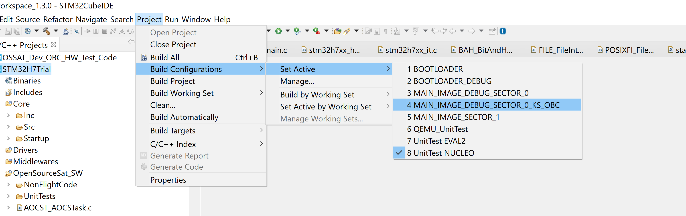
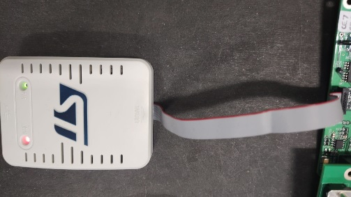

# Running application code on the OBC
This readme gives the details you'll need to run our OSSAT application on our OSSAT OBC development board, it also gives details of how to use the simple command line interface and how to get the file system going.  

## Contents
- [Building the code](#building-the-code)
- [Running the code](#running-the-code)
- [Using the CLI](#using-the-cli)
- [Formatting the disk](#formatting-the-disk)
- [Uploading files](#uploading-files)
- [Downloading files](#deownloading-files)
- [Reading the Command and Error Log](#reading-the-command-and-error-log)

## Building the code
If you are an OSSAT collaborator, you'll be able to access the OBC application code at [this](https://github.com/Open-Source-Satellite/OSS-Demo-Project-STM32H7) repository. For information about building the code, go to this repository.

**NOTE: The STMCubeIDE project includes build configurations for different builds (e.g. Unit Tests, Bootloader, Main Application etc). Therefore, before hitting the build button, you'll need to switch to the relevant build configuration which is MAIN_IMAGE_DEBUG_SECTOR_0_KS_OBC. This change can be made by navigating to the Project dropdown->Build Configurations->Set Active->MAIN_IMAGE_DEBUG_SECTOR_0_KS_OBC. See the below image:

## Running the code
In order to run the code, you'll need some form of UART/Serial terminal program. We tend to use [TeraTerm](https://ttssh2.osdn.jp/index.html.en). You'll also need an [ST Link SWD/JTAG device](https://www.st.com/en/development-tools/stlink-v3set.html). The board is designed with a compatible SWD/JTAG connector.

Perform the following procedure:
1. Connect the ST Link to the board and 

2. Apply 5V to the micro USB power connection to the board (a seperate connector to the ST-Link). (setting any relevant current limit to 0.5A should provide plenty of power to overcome in-rush).
3. 

